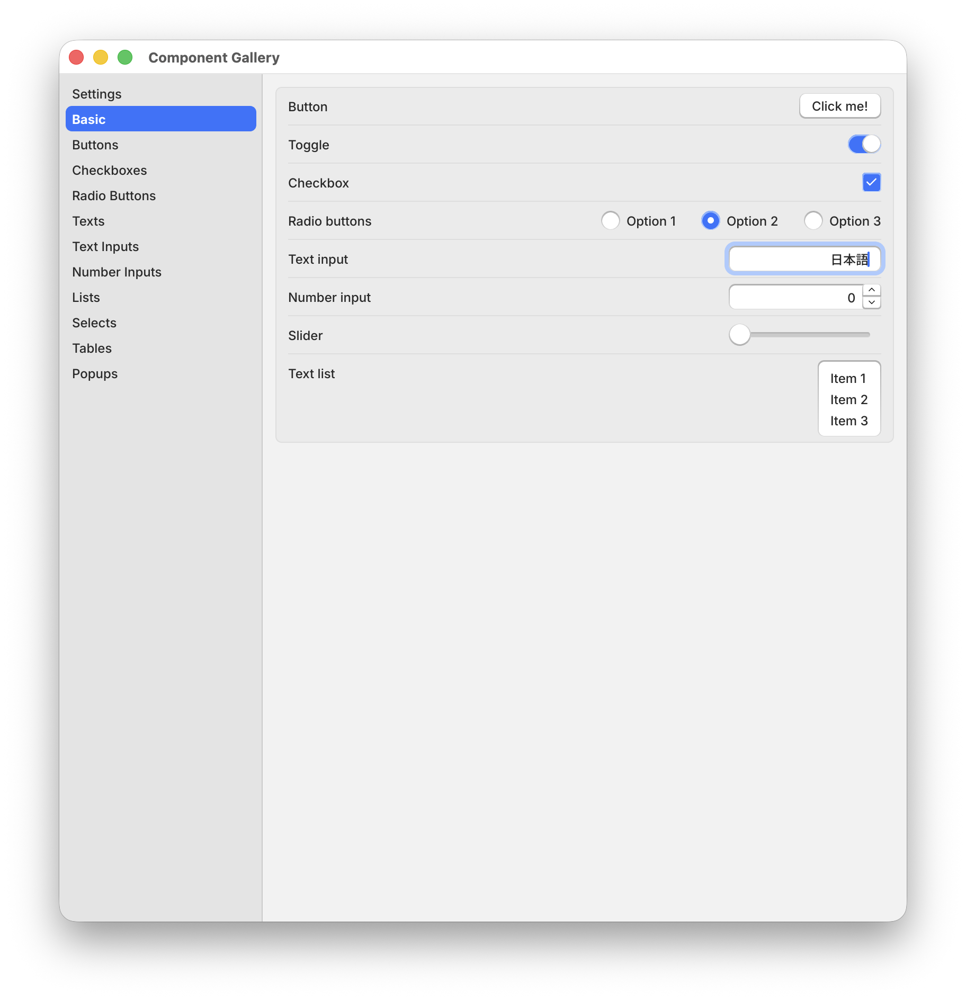
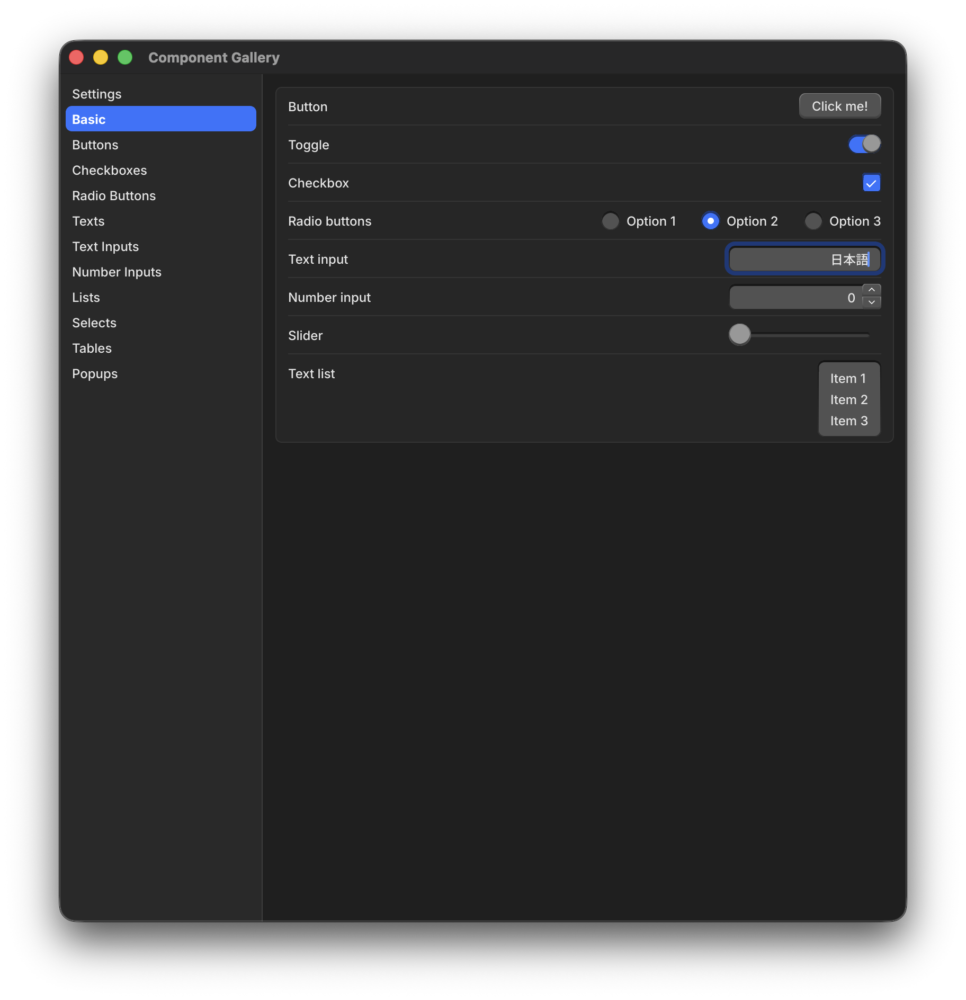

# Guigui (ぐいぐい)

**An immediate-mode-inspired GUI framework for Go**

> [!CAUTION]
> **This project is an alpha version, and everything may change in the future.**

> [!WARNING]
> Except for minor changes like typo fixes, we have not yet established a development policy for accepting changes. For new features, please [file an issue](https://github.com/guigui-gui/guigui/issues/new) or make your proposal in [Discussion](https://github.com/guigui-gui/guigui/discussions/13).

> [!NOTE]
> AI is used in the development of this project, but all changes are reviewed by the committer before committing.

 * Compilable without C compilers
 * No HTML, CSS, or JavaScript required
 * Hi-DPI support for clear visuals on modern displays
 * Built-in internationalization (I18N) support for multiple languages
 * Efficient rendering with optimized draw calls for better performance

| Light Mode | Dark Mode |
| --- | --- |
|  |  |

```sh
git clone https://github.com/guigui-gui/guigui.git
cd guigui
go run ./example/gallery
```

## For AI agents

If you use an AI coding agent to write or modify Guigui code, point it at
[`skills`](skills). The `using-guigui` skill
there documents the widget lifecycle, layout, and conventions so the agent
produces idiomatic Guigui code.

Guigui runs on [Ebitengine](https://ebitengine.org/), so to run, test, or
screenshot a Guigui app without a window, also point the agent at
Ebitengine's
[`run-ebitengine-app-headless`](https://github.com/hajimehoshi/ebiten/tree/main/skills/run-ebitengine-app-headless)
skill. It drives an app headlessly, injects input, and reads back rendered
frames so the agent can verify behavior end to end.

The link above points at Ebitengine's `main` branch. The skill documents the
APIs of the version it ships with, so use the tag or branch matching the
Ebitengine version your project depends on.
